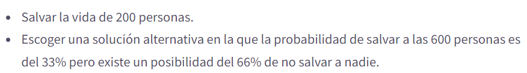
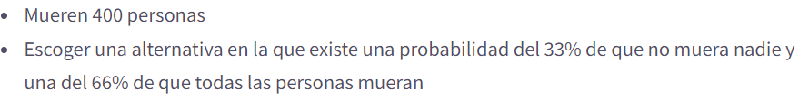

- # Unidad 1  #yellow
  collapsed:: true
  Fundamentos de la economía experimental y del comportamiento (ECC)
	- ## 1. 1 Economía como disciplina Experimental #red ((61993a92-3c67-4e6d-a4de-3637d9faee8c))
	- ## 1. 2 Principios de la Economía Experimental #red
	- ## 1.3 Economía del Comportamiento
	  collapsed:: true
		- ¿ Que es a Economía del comportamiento?
		  collapsed:: true
			- Es una rama de la [[Economía]] que se basa en **uso** de la **evidencia** de la economía clasica , la [[Psicología]] y otras ciencias sociales , para **crear escenarios de estudio**  de la toma de decisiones, no basadas en la optimización del modelo clasico
		- ¿Qué estudia la Economía del comportamiento?
		  collapsed:: true
			- Se encarga por ende del estudio de tendencias cognitivas, emociones humanas y sociales  en busca de una mejor comprensión de la toma de decisiones económicas
		- ¿ Que busca la Economía del comportamiento?
		  collapsed:: true
			- Busca ampliar la racionalidad
			- Busca entender el comportamiento humano y sus consecuencias
		- ¿ Cual es el interés de los [[biólogos]] y [[psicólogos]] en la economía del comportamiento?
		  collapsed:: true
			- Debido al enfoque de calculo y maximización lógica en mecanismos biológicos esto es el campo de la [[Neureconomía]]
		- ¿  Cual es la relación entre Economía del comportamiento  y el modelo económico estándar?
		  collapsed:: true
			- La base de la relación
			  collapsed:: true
				- La economía del comportamiento  trata de probar el [[modelo económico estándar]] en humanos, pudiendo así refinarlo con lo que verdaderamente se observa en el mundo real
			- Herramientos
			  collapsed:: true
				- Ciencias Sociales Varias
				  collapsed:: true
					- [[Psicología]]
				- Experimentos de laboratorio
				- Herramientas empiricas
				  collapsed:: true
					- Encuestas
					- Estudios de caso
					- Métodos estadístico
			- Camerer (2004) señala que la economía conductual aumenta el poder explicativo de la economía al darle a esta una base [[Psicología]] mas realista, además de extender  la [[Elección Racional]] y los [[Modelos de Equilibrio]] (Camerer,2006).
		- ¿Por que es un campo respetable dentro de la economía?
		  collapsed:: true
			- Debido al éxito al explicar anomalías del modelo estándar y el desarrollo teórico que a tenido, se a convertido en un campo respetable
		- Historia y evolución de la teoría del comportamiento
		  collapsed:: true
			- Bernoulli (1738)
			  collapsed:: true
				- Explica la aversión al riesgo en función a utilidad marginal decreciente del dinero.
			- Adam Smith (1759)
			  collapsed:: true
				- Teoría de los sentimientos morales: rolde las emociones en la toma de decisiones.
			- Bentham ( 1789)
			  collapsed:: true
				- Aborda el concepto de utilidad con base en el sentimiento de bienestar del  los sujetos.
			- Post-Guerra ( 1940-...)
			  collapsed:: true
				- Aplicación de econometría y procesos computacionales
				- Friedman: La complejidad del comportamiento no requiere atención, pero si sus generalidades, la teoría económica no se planteaba la precisión de sus supuestos.
			- Simon(1955)
			  collapsed:: true
				- Plantea lo que se conoce como [[Racionalidad Limitada]]
			- Decadas ('50s-'60s)
			  collapsed:: true
				- Se evidencia mediante estudios las anomalías a la hora de tomar decisiones
				-
			-
			  ---
			- Daniel Kahneman y Amos Tverskey (' 70s)
			  collapsed:: true
				- Nace la  Economía del Comportamiento con la obra:
					- Prospect theory: An analysis of decision under risk’
			-
			  ---
			-
		- Metodología de la Economía del comportamiento 
		  collapsed:: true
			- Teoría
			  collapsed:: true
				- Identificar teorías adecuadas , supuestos, axiomas
			- Evidencia
			  collapsed:: true
				- Estudio de campo
				  collapsed:: true
					- Experimento
					- Encuestas
					- Estudios de caso
					-
				- ¿ Por que no presenta problemas de validez?
				  collapsed:: true
					- Debido a que representa la realidad como es
				- ¿ Por que presenta problema de validez conceptual ?
				  collapsed:: true
					- Por el cuestionamiento ¿ Mide lo que se pretende?
				- ¿Qué son los factores confusores ?
				  collapsed:: true
					- Debido a efectos en el resultado que no se pueden aislar
			- Conciliación
				- Disposición a unir conocimientos e información de diversas disciplinas para crear un marco de entendimiento
		- Diferencias entre Economía Experimental y Economía del Comportamiento
		- |**Economía del Comportamiento** | **Economía experimental**| 
		  | Teorías para explicar el comportamiento en entornos económicos | Enfoque Metodológico|
		  |Interdisciplinario| Kit de herramientas|
		  |No descarta supuestos clásicos| Comprueba o refuta la economía clásica|
		- > No existe una relación necesaria entre economía conductual y la experimental
		-
		-
- # Unidad 2
	- ## Ampliación de la Racionalidad
	  collapsed:: true
		- ¿ Cuales son las características de los procesos involucrados en la toma de decisiones?
		  collapsed:: true
			- Preferencias
			  collapsed:: true
				- Escalas definida sobre un conjunto de bienes, basadas en valores y actitudes con los posibles resultados
			- Creencias
			  collapsed:: true
				- Son la probabilidad que damos a la ocurrencia de cada resultado, en base a la información que disponemos de que se de ese resultado.
			- [[Racionalidad]]
				-
		- {{embed ((61986c0a-c73c-4efc-8d25-a4989c91fe8c))}}
		- De acuerdo con los axiomas y supuestos descritos , somos:
		  collapsed:: true
			- Racionales
	- ## 1. Sesgo cognitivo #yellow
	  id:: 61985334-f1bd-466f-a97e-9543d114a293
	  collapsed:: true
		- ¿ Donde se presentan los sesgos cognitivos?
		  collapsed:: true
			- Antes de revisar los sesgos , debemos plantearnos cuales son los criterios que se postulan en la racionalidad y que se ven influenciados por estos segos
			- {{embed ((61993171-c97f-46cb-a0bf-b2d27fbff677))}}
			  id:: 61997b0e-18bf-42f5-9a86-efda43a5b885
		- ¿ Que es un sesgo cognitivo?
		  collapsed:: true
			- Es una interpretación errónea sistemática de la información disponible  a la hora de procesar pensamientos, hacer juicios de valor y ==tomar decisiones==
		- Efectos #red
			- Efecto dotación
			  collapsed:: true
				- Este efecto nos causa que tendemos a valorar más un objeto que poseemos frente a otro que todavía no es nuestro.  Nos cuesta mas despegarnos de las cosas con las que hemos creado un vinculo emocional asociado a la de propiedad.
				- Esto quiere decir que damos utilidad a algo dependiendo de la posesión de aquello.
				- Factor [[Psicología]] principal: aversión al riesgo
				- Importancia dentro de la economía: La propiedad y los intercambios son ejes de la economía
			- Efecto Marco
			  collapsed:: true
				- Es un  [[sesgo cognitivo]]  en el cual las personas tienden a evitar los riegos , si las opciones se plantean en función de la ganancia, pero suelen ser mas arriesgadas , si el problema se plantea en forma que implique perdida.
				- Ejemplo:
				- Se plantea en forma de ganancia
				- 
				- En esta ocasión se eligió en su mayoría la primera opción
				- Ahora se presenta en forma de perdida
				- 
				- En esta ocasión se escogió la segunda opción
				- Viola el supuesto ((619971f6-62bf-47ca-a1cf-eb0f11796938))
			- Efecto Anclaje
			  collapsed:: true
				- Es un  [[sesgo cognitivo]] debido al anclaje ya ajuste que provoca darle un mayor peso a la primera noticia, argumento o evidencia que se tiene sobre algo a la hora de tomar una decisión, de esta forma ajustando la respuesta del individuo hasta tener una respuesta final, usando esta primera impresión como ancla de su respuesta. Sesgando la respuesta final entorno a este ajuste o ancla inicial.
				-
				  id:: 619a437e-524a-4307-af41-bd6334f6012b
				  link:: https://bit.ly/3nDh9BH
			- Efecto gratis
			  collapsed:: true
				- Le damos un mayor valor a las cosas cuando se las anuncia como "Gratis"
		- Falacias #yellow
		  id:: 61984d8e-6a49-43b5-9976-544cefe9b6f3
		  collapsed:: true
			- Son un tipo de sesgo cognitivo que distorsionan ((61984d1e-b1e3-4ffb-909b-c5efe8e02089))  el como captamos la realidad
			- Falacia del [[coste hundido]] #yellow
			  collapsed:: true
				- Es un ((61985334-f1bd-466f-a97e-9543d114a293)) que consiste en darle valor y esfuerzo a una inversión irrecuperable, algo que nunca va a volver, con la única razón de mantener a flote un programa, proyecto una decisión , por la expectativa de recuperar lo entregado (dinero, tiempo, etc.) y por el temor que nos inspira asumir la pérdida  de lo entregado.
				-
				-
	- ## 2. Heurísticas y actualización Bayesiana
		- Heurística de disponibilidad
			- Este sesgo nos genera que demos mayor probabilidad a un evento que es de fácil recordad. Esto pude generar que estimemos con mayor probabilidad la ocurrencia de eventos raros debido a que es lo primero que recordamos, pudiendo deberse esto a la publicidad que hayamos visto de ese evento
			- En pocas palabras nuestra mente utiliza ejemplos inmediatos, los que primero se te vienen a la cabezas , para calcular las probabilidades de algo que este pasando.
			- Por ejemplo si quiero una gaseosa; en lo primero que pienso es Cocacola, como la que mayor probabilidad de bienestar o satisfacción me puede dar ante esa necesidad
	-
- Dcoumentos
  collapsed:: true
	- Unidad 1
		- 
	- Unidad 2
		- 
		- 
		- 
-
-
-