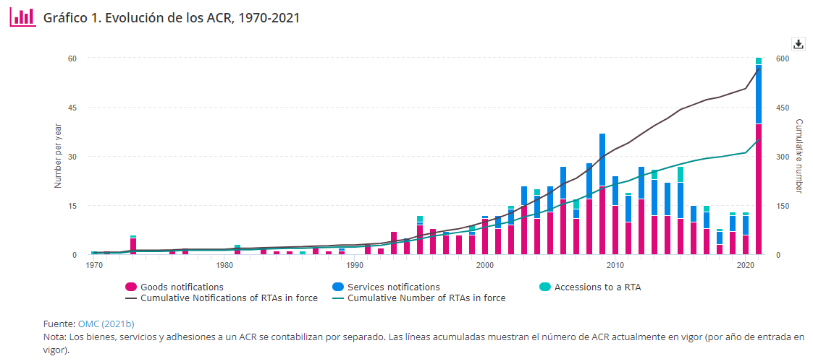
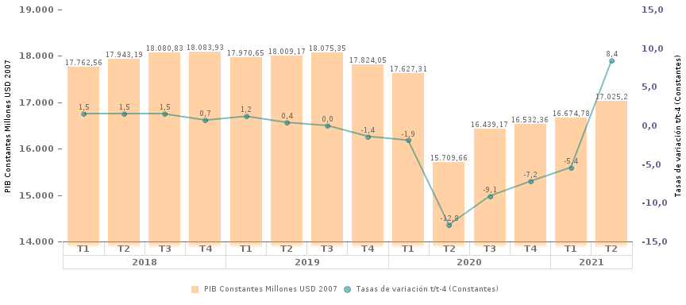

- Evolución de los tratados  comerciales internacionales  :[🔗](https://sdgpulse.unctad.org/trade-barriers/)
  collapsed:: true
	- {:height 328, :width 714}
- PIB  Nominal Ecuador →  [BCE ](https://sintesis.bce.fin.ec/BOE/OpenDocument/2109181649/OpenDocument/opendoc/openDocument.faces?logonSuccessful=true&shareId=0)
-
- Tipo:
- Analissi Compartivo de Comercio exterior Ecuador 
  collapsed:: true
	- https://www.centrosureditorial.com/index.php/revista/article/view/81/221
- {:height 325, :width 714}
-
  

    8% 
    PIB 
  

-
-
  
-
-
-